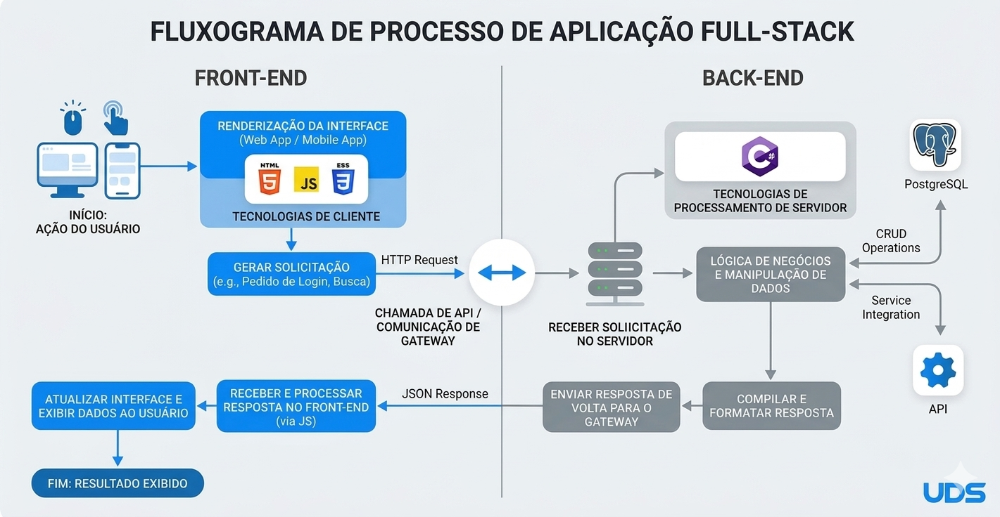

# 4. Projeto da Solução

---

## 4.1 Arquitetura da Solução (Sprint 1 e 2)

### 📎 Inserir o Diagrama de Arquitetura do Projeto do Grupo

## 4.2 Tecnologias Utilizadas (Sprint 1)

Descreva as tecnologias, linguagens, frameworks, bibliotecas e serviços escolhidos pelo Squad.

| Dimensão | Tecnologia Escolhida |
|----------|----------------------|
| Banco de Dados (SGBD) | PostgreSQL |
| Back-end (API) | C# (ASP.NET Core) |
| Front-end / Mobile | HTML + CSS + JavaScript |
| Hospedagem / Deploy | Ainda não definido - provavelmente Vercel/ Render |
| Gestão e Versionamento | GitHub e Trello |

---

##  4.3 Wireframes ou Mockups (A partir da Sprint 2)

Apresente os protótipos das telas (Wireframes/Mockups) apenas das funcionalidades que estão sendo implementadas na Sprint atual.

Cada Wireframe ou Mockups devem estar associados a pelo menos:

- Um Requisito Funcional (RF-XX)
- Uma História de Usuário

## 📌 Exemplo Ilustrativo – Tela de Cadastro (RF-01)

**História associada:** Como usuário, quero criar uma conta para acessar o sistema.

Representação simplificada do Wireframe:

**Descrição:** A interface contempla todos os campos exigidos pelo RF-01 e permite persistência no banco após validação no backend.

---
🔧 **Ferramentas sugeridas:**
- Figma  
- MarvelApp  
- Balsamiq  
---

### 📎 Inserir AQUI Wireframes/ Mockups do Projeto de Software

🚨 O grupo deverá inserir aqui a imagem

---

## 4.4 Modelagem de Dados (Sprint 2 e 3)

---

### 4.4.1 Script Físico (Entrega na Sprint 2 - MVP)

#### 🔹 Para Banco Relacional (SQL)

CREATE TABLE CPUs (
  Id SERIAL PRIMARY KEY,
  Nome TEXT NOT NULL,
  Fabricante TEXT NOT NULL,
  Socket TEXT NOT NULL,
  TDP INTEGER NOT NULL
);

CREATE TABLE GPUs (
  Id SERIAL PRIMARY KEY,
  Nome TEXT NOT NULL,
  TDP INTEGER NOT NULL,
  ConsumoRecomendado INTEGER NOT NULL,
  Comprimento INTEGER NOT NULL
);

CREATE TABLE Motherboards (
  Id SERIAL PRIMARY KEY,
  Nome TEXT NOT NULL,
  Socket TEXT NOT NULL,
  TipoRamSuportado TEXT NOT NULL,
  CapacidadeMaximaRam INTEGER NOT NULL,
  SlotsRam INTEGER NOT NULL
);

CREATE TABLE PSUs (
  Id SERIAL PRIMARY KEY,
  Nome TEXT NOT NULL,
  Potencia INTEGER NOT NULL,
  Certificacao TEXT NOT NULL
);

CREATE TABLE RAMs (
  Id SERIAL PRIMARY KEY,
  Nome TEXT NOT NULL,
  Tipo TEXT NOT NULL,
  Capacidade INTEGER NOT NULL,
  QuantidadeModulos INTEGER NOT NULL
);

CREATE TABLE Usuarios (
  Id SERIAL PRIMARY KEY,
  Nome TEXT NOT NULL,
  Email TEXT NOT NULL UNIQUE,
  Senha TEXT NOT NULL,
  Admin BOOLEAN NOT NULL DEFAULT FALSE
);

### 📁 Obrigatório

O arquivo .sql ou .js deve ser salvo na pasta: src/bd

 - É permitido colar um trecho do script no README apenas para visualização rápida.
 
---
### 4.4.2 Representação do Modelo Físico de Dados (Entrega na Sprint 3 - Core)

> **Fundamentação:** Os modelos de dados físicos fornecem detalhes minuciosos que auxiliam administradores e desenvolvedores na implementação da lógica de negócios em um banco de dados real.
> Eles incluem elementos não especificados no modelo lógico, como:
> - Tipos de dados específicos da plataforma
> - Restrições
> - Índices
> - Triggers (quando aplicável)
> - Procedimentos armazenados (quando aplicável)
>
>Por representarem um banco real, devem respeitar:
> - Convenções de nomenclatura
> - Restrições da plataforma
> - Uso adequado de palavras reservadas  

**Exemplo:**

**FONTE:** <https://aws.amazon.com/pt/compare/the-difference-between-logical-and-physical-data-model/>

 O grupo deverá gerar um diagrama físico do banco de dados (estrutura real das tabelas), evidenciando PKs, FKs e relacionamentos, conforme implementado no código.

Este modelo deve exibir:
- Tabelas ou coleções existentes
- Atributos com seus respectivos tipos de dados
- Chaves Primárias (PK)
- Chaves Estrangeiras (FK)
- Relacionamentos entre tabelas
- Restrições implementadas (quando aplicável)

---

### 📌 Requisitos Obrigatórios

- O diagrama deve representar fielmente o banco já implementado.
- Deve refletir exatamente o que foi criado nas Sprints 2 e 3.
- Não incluir tabelas que não existam no código.
- Deve contemplar o controle de acesso de usuários, quando implementado.
- Deve respeitar as convenções e restrições da plataforma utilizada.

---

### 📎 Representação do Modelo Físico de Dados
🚨 O grupo deverá inserir aqui a imagem do diagrama físico de dados.

---
🔧**Ferramentas Sugeridas**
- MySQL Workbench (engenharia reversa automática)
- DbDesigner
- Lucidchart
